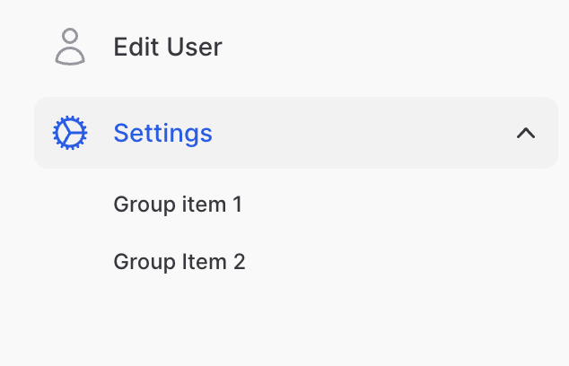
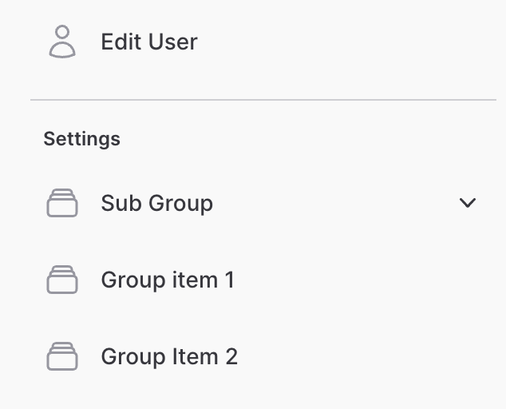
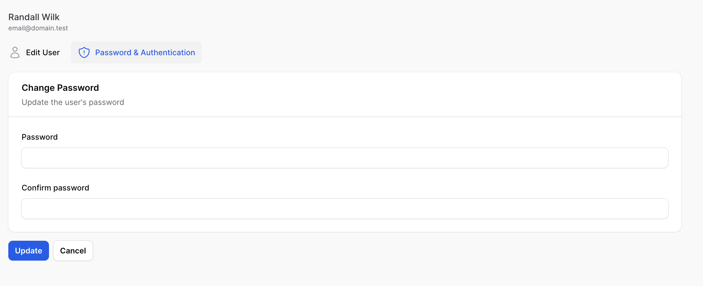

# filament-inner-nav

[](https://packagist.org/packages/rawilk/filament-inner-nav)

[](https://packagist.org/packages/rawilk/filament-inner-nav)
[](https://packagist.org/packages/rawilk/filament-inner-nav)
[](https://github.com/rawilk/filament-inner-nav/blob/main/LICENSE.md)


The `filament-inner-nav` package allows you to organize resource pages in your Filament panels into a group of "inner navigation" pages. This is useful for when you have a
resource page that has many sub-pages, such as when viewing/editing a user record.


## Installation

You can install the package via composer:

```bash
composer require rawilk/filament-inner-nav
```

You can publish the config file with:

```bash
php artisan vendor:publish --tag="filament-inner-nav-config"
```

You can view the default configuration here: https://github.com/rawilk/filament-inner-nav/blob/main/config/filament-inner-nav.php

The views can be published with:

```bash
php artisan vendor:publish --tag="filament-inner-nav-views"
```

## Usage

1. First, you need to generate a filament resource page and then add your custom resource pages to the array from `getPages`. For example, a `UserResource`:

    ```php
    use App\Filament\Resources\UserResource\Pages;
    use Filament\Resources\Resource;

    class UserResource extends Resource
    {
        // ...

        public static function getPages(): array
        {
            'index' => Pages\ListUsers::route('/'),
            'create' => Pages\CreateUser::route('/create'),
            'edit' => Pages\EditUser::route('/{record}/edit'),

            // custom pages...
            'authentication' => Pages\UserAuthentication::route('/{record}/authentication'),
            'contact' => Pages\Contact::route('/{record}/contact'),
            'activity' => Pages\Activity::route('/{record}/activity'),
        }

        // ...
    }
    ```

2. Define a `$record` property on each of your custom resource pages:
    ```php
    public ModelName $record; // public User $record;
    ```
    > Be sure to change `ModelName` to the class name of your model.
3. Define an `innerNav` static method on your resource:

    ```php
    use App\Models\User;
    use Filament\Resources\Resource;
    use Rawilk\FilamentInnerNav\InnerNav;
    use Rawilk\FilamentInnerNav\InnerNavItem;

    class UserResource extends Resource
    {
        // ...

        public static function innerNav(User $record): InnerNav
        {
            return InnerNav::make()
                ->setNavigationItems([
                    InnerNavItem::make('Edit User')
                        ->url(fn (): string => static::getUrl('edit', ['record' => $record])),
                    InnerNavItem::make('Password & Authentication')
                        ->url(fn (): string => static::getUrl('authentication', ['record' => $record])),
                    InnerNavItem::make('Contact Information')
                        ->url(fn (): string => static::getUrl('contact', ['record' => $record])),
                    InnerNavItem::make('Activity')
                        ->url(fn (): string => static::getUrl('activity', ['record' => $record])),
                ]);
        }
    }
    ```

4. In each of your custom pages, wrap the content inside of the `<x-filament-inner-nav::page>` blade component:
    ```html
    <!-- file: filament.resources.user-resource.pages.authentication -->
    <x-filament-panels::page>
        <x-filament-inner-nav::page>
            <!-- page content here -->
        </x-filament-inner-nav::page>
    </x-filament-panels::page>
    ```

## Advanced Usage

### Enable `wire:navigate`

Allow the usage of livewire's `wire:navigate` by using the `wireNavigate()` method on the `InnerNav` object:

```php
public static function innerNav(User $record): InnerNav
{
    return InnerNav::make()
        ->wireNavigate()
        ->setNavigationItems([
            // ...
        ]);
}
```

> This option can be globally configured in a service provider. See [Global Configuration](#global-configuration).

### Title & Description

You can set a title and/or description for the navigation via the `setTitle()` and `setDescription()` methods on the `InnerNav` object.
These will show up directly above the navigation items.

```php
public static function innerNav(User $record): InnerNav
{
    return InnerNav::make()
        ->setTitle('Nav title')
        ->setDescription('Nav description')
        ->setNavigationItems([
            // ...
        ]);
}
```

For more advanced customization, you may return an `HtmlString` object from a closure with either of these methods:

```php
public static function innerNav(User $record): InnerNav
{
    return InnerNav::make()
        ->setTitle(fn (): HtmlString => new HtmlString('<h1>' . $record->name . '</h1>'))
        ->setDescription(fn (): HtmlString => new HtmlString('<p>Nav description</p>'))
        ->setNavigationItems([
            // ...
        ]);
}
```

### Item Icons

You can set an icon for each navigation item via the `icon()` method on the `InnerNavItem` object:

```php
public static function innerNav(User $record): InnerNav
{
    return InnerNav::make()
        ->setNavigationItems([
            InnerNavItem::make('Edit User')
                ->url(fn (): string => static::getUrl('edit', ['record' => $record]))
                ->icon('heroicon-o-pencil'),
        ]);
}
```

### Item Active State

By default, active state is not set on any navigation item. You may call the `isActiveWhen()` method on the `InnerNavItem` object to set active state.

```php
public static function innerNav(User $record): InnerNav
{
    return InnerNav::make()
        ->setNavigationItems([
            InnerNavItem::make('Edit User')
                ->url(fn (): string => static::getUrl('edit', ['record' => $record]))
                ->isActiveWhen(fn (): bool => request()->route()->action['as'] === 'filament.resources.users.edit')
        ]);
}
```

### Item Visibility

Items can be hidden from the UI by calling either the `visible()` or `hidden()` methods on the `InnerNav` object.

```php
public static function innerNav(User $record): InnerNav
{
    return InnerNav::make()
        ->setNavigationItems([
            InnerNavItem::make('Edit User')
                ->url(fn (): string => static::getUrl('edit', ['record' => $record]))
                ->visible(fn (): bool => auth()->user()->can('edit', $record)),
        ]);
}
```

### Disabling Items

There may be cases where you still want to show the navigation link, but disable the user from actually visiting it. You may use the `isDisabledWhen()` method on the `InnerNavItem` object for this.

```php
public static function innerNav(User $record): InnerNav
{
    return InnerNav::make()
        ->setNavigationItems([
            InnerNavItem::make('Edit User')
                ->url(fn (): string => static::getUrl('edit', ['record' => $record]))
                ->isDisabledWhen(fn (): bool => ! auth()->user()->can('edit', $record)),
        ]);
}
```

### Item Badges

You may add a badge to any navigation item by calling the `badge()` method on the `InnerNavItem` object.

```php
public static function innerNav(User $record): InnerNav
{
    return InnerNav::make()
        ->setNavigationItems([
            InnerNavItem::make('Edit User')
                ->url(fn (): string => static::getUrl('edit', ['record' => $record]))
                ->badge('New'),
        ]);
}
```

### Groups

Items can be grouped in the navigation by using the `InnerNavGroup` object. A group can either be collapsible
or static. Collapsible groups can be nested inside a static group. Below will be an example of each group.

#### Collapsible Group

Collapsible groups allow you to nest a group of navigation items underneath a button that can toggle the visibility of the items.
The UI for this is inspired by how GitHub handles their sub navigation on your account settings pages.

```php
public static function innerNav(User $record): InnerNav
{
    return InnerNav::make()
        ->setNavigationItems([
            InnerNavItem::make('Edit User')
                ->url(fn (): string => static::getUrl('edit', ['record' => $record])),
            InnerNavGroup::make('Settings')
                ->icon('heroicon-o-cog')
                ->items([
                    InnerNavItem::make('Group item 1')
                        ->url('#'),
                    InnerNavItem::make('Group Item 2')
                        ->url('#'),
                ])
        ]);
}
```



**Note:** The `icon` method is optional on the `InnerNavGroup` object.

> `InnerNavItem` objects underneath an `InnerNavGroup` are not allowed to have an icon.

> By default, collapsible groups are collapsed. You can change this by calling the `expandByDefault()` method on the `InnerNavGroup` object.
> The group will also be expanded if any of the items inside it are set to active.

#### Static Groups

Also inspired by the GitHub UI, static groups allow you to render navigation links underneath a heading.

```php
public static function innerNav(User $record): InnerNav
{
    return InnerNav::make()
            ->setLayout(InnerNavLayout::Side)
            ->setTitle($record->name->full)
            ->setDescription('email@domain.test')
            ->wireNavigate()
            ->setNavigationItems([
                InnerNavItem::make('Edit User')
                    ->url(fn () => self::getUrl('edit', ['record' => $record]))
                    ->icon('heroicon-o-user'),
                InnerNavGroup::make('Settings')
                    ->collapsible(false)
                    ->items([
                        InnerNavGroup::make('Sub Group')
                            ->icon('heroicon-o-rectangle-stack')
                            ->items([
                                InnerNavItem::make('Sub group item 1')
                                    ->url('#'),
                            ]),
                        InnerNavItem::make('Group item 1')
                            ->icon('heroicon-o-rectangle-stack')
                            ->url('#'),
                        InnerNavItem::make('Group Item 2')
                            ->icon('heroicon-o-rectangle-stack')
                            ->url('#'),
                    ]),
}
```



> Unlike with a collapsible group, the direct `InnerNavItem` children are allowed to have icons.

### Top Layout

If you want to render the links on top of your content, instead of on the side, you may use the `setLayout()` method on the `InnerNav` object:

```php
use Rawilk\FilamentInnerNav\Enums\InnerNavLayout;
use Rawilk\FilamentInnerNav\InnerNav;

public static function innerNav(User $record): InnerNav
{
    return InnerNav::make()
        ->setLayout(InnerNavLayout::Top)
        ->setNavigationItems([
            // ...
        ]);
}
```



> Any `InnerNavGroup` objects added with this layout will be rendered as a dropdown menu.

### Global Configuration

Many options on the `InnerNav`, `InnerNavItem`, and `InnerNavGroup` objects can be configured globally, typically in a service
provider somewhere.

```php
use Illuminate\Support\ServiceProvider;
use Rawilk\FilamentInnerNav\Enums\InnerNavLayout;
use Rawilk\FilamentInnerNav\InnerNav;
use Rawilk\FilamentInnerNav\InnerNavGroup;

class AppServiceProvider extends ServiceProvider
{
    public function boot(): void
    {
        InnerNav::configureUsing(function (InnerNav $nav) {
            $nav
                ->wireNavigate()
                ->setLayout(InnerNavLayout::Side);
        });

        InnerNavGroup::configureUsing(function (InnerNavGroup $group) {
            // Expand collapsible groups by default.
            $group->expandByDefault();
        });
    }
}
```

## Scripts

### Setup

For convenience, you can run the setup bin script for easy installation for local development.

```bash
./bin/setup.sh
```

### Formatting

Although formatting is done automatically via workflow, you can format php code locally before committing with a composer script:

```bash
composer format
```

## Testing

```bash
composer test
```

## Changelog

Please see [CHANGELOG](CHANGELOG.md) for more information on what has changed recently.

## Contributing

Please see [CONTRIBUTING](.github/CONTRIBUTING.md) for details.

## Security

Please review [my security policy](.github/SECURITY.md) on how to report security vulnerabilities.

## Credits

-   [Randall Wilk](https://github.com/rawilk)
-   [All Contributors](../../contributors)

## License

The MIT License (MIT). Please see [License File](LICENSE.md) for more information.
